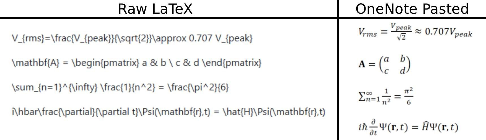

# LaTeX-to-OneNote

Simple Python script to convert LaTeX equations into OneNote pastable math objects.

OneNote doesn't natively support typing or pasting raw LaTeX (or at least not well), and its built-in equation editor is annoying and slow. This script takes your raw LaTeX, converts it to Office Math ML (OMML) using Pandoc, and puts it on your clipboard ready to paste. 
Basic Architecture: Clipboard/Input (LaTeX) -> Pandoc -> Word Doc (OMML) -> Extract XML -> Reformat -> Clipboard (HTML+OMML)



## Setup

**Open PowerShell, navigate to the directory, and run the setup script:** 
(Installs Pandoc, Python venv, and required packages)
```powershell
.\setup_env.ps1
```

## Usage

**Method 1: Clipboard (Easiest)**
1.  Copy any LaTeX to your clipboard (e.g., `V_{rms}=\frac{V_{peak}}{\sqrt{2}}`).
2.  Run the script:
    ```bash
    python latex_to_onenote.py
    ```
3.  Paste into OneNote (`Ctrl+V`).

**Method 2: Command Line**
```bash
python latex_to_onenote.py "E=mc^2"
```

**Options:**
*   `-f`: Force conversion even if the input doesn't look like LaTeX (skips safety check).

**Requirements:**
*   Pandoc (installed by setup script)
*   Python 3.x

