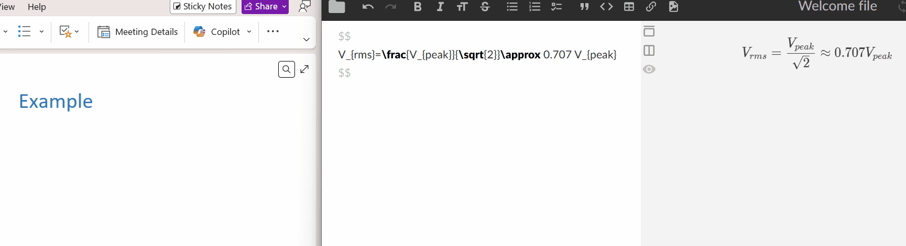

# LaTeX-to-OneNote

Simple Python script to convert LaTeX equations into OneNote pastable math objects.

OneNote doesn't natively support typing or pasting raw LaTeX (or at least not well), and its built-in equation editor is annoying and slow. This script takes your raw LaTeX, converts it to Office Math ML (OMML) using Pandoc, and puts it on your clipboard ready to paste. 
Basic Architecture: Clipboard/Input (LaTeX) -> Pandoc -> Word Doc (OMML) -> Extract XML -> Reformat -> Clipboard (HTML+OMML)



## Setup

1. Download or clone this repo.
2. Install [Python 3.x](https://www.python.org/downloads/) if you don't have it.
3. Launch the `setup_env.ps1` PowerShell script to install dependencies and setup venv.
   

## Usage

**Method 1: Clipboard**
1.  Copy any LaTeX to your clipboard (e.g., `V_{rms}=\frac{V_{peak}}{\sqrt{2}}`).
2.  Run the script:
    ```bash
    python latex_to_onenote.py
    ```
3.  Paste into OneNote (`Ctrl+V`).

**Method 2: Command Line**
```bash
python latex_to_onenote.py "E=mc^2"
```

**Method 3: Auto Hotkey Script (Recommended)**

Use the included **AutoHotkey** script, `latex_to_onenote.ahk` to easily paste raw LaTeX directly from your clipboard into OneNote using `Ctrl+Alt+L`
1.  Install [AutoHotkey](https://www.autohotkey.com) v1.1, not v2 compatible.
2.  Run `latex_to_onenote.ahk`.
3.  Copy your LaTeX, select OneNote and press `Ctrl+Alt+L`. The script will paste the result if it succeeds.
    *   *Note: Auto pasting can be disabled via the system tray icon right-click menu.*

**Options:**
*   `-f`: Force conversion even if the input doesn't look like LaTeX (skips safety check).

**Requirements:**
*   Pandoc (installed by setup script)
*   Python 3.x

